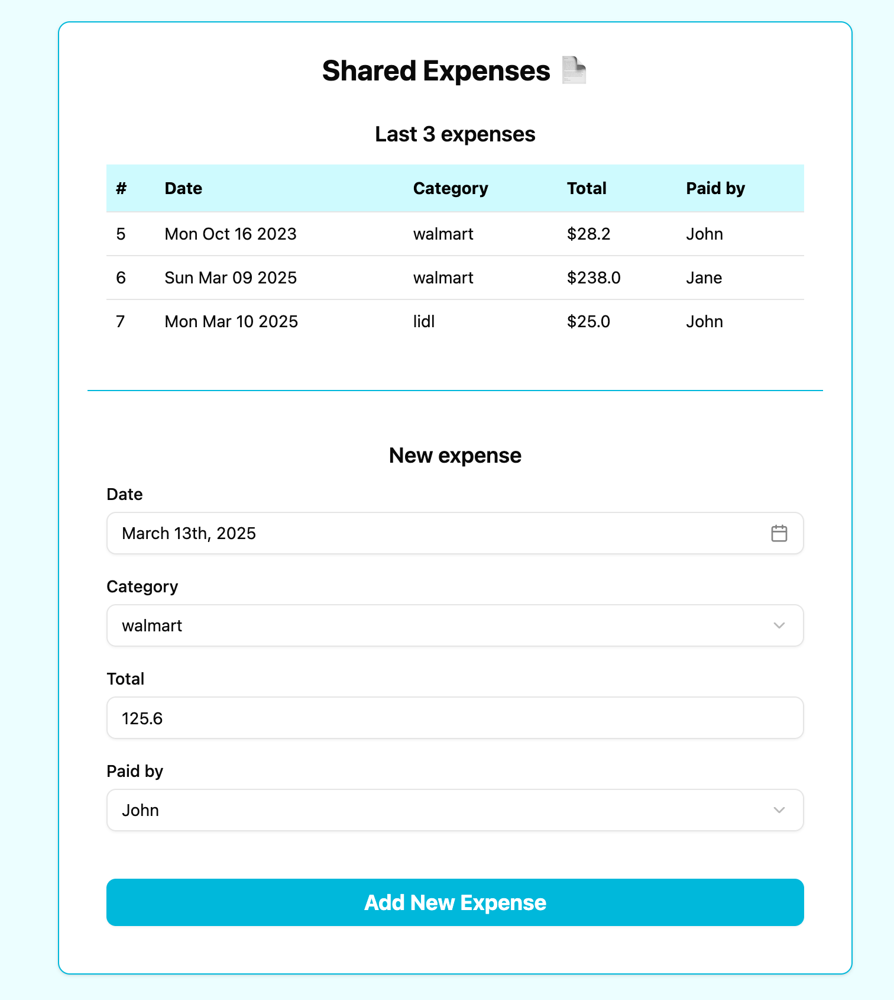
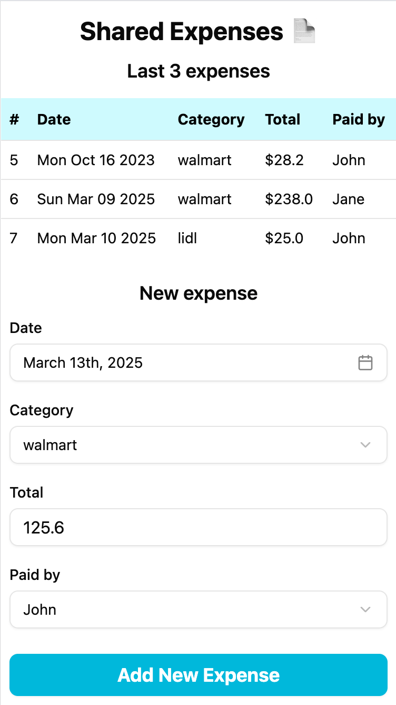
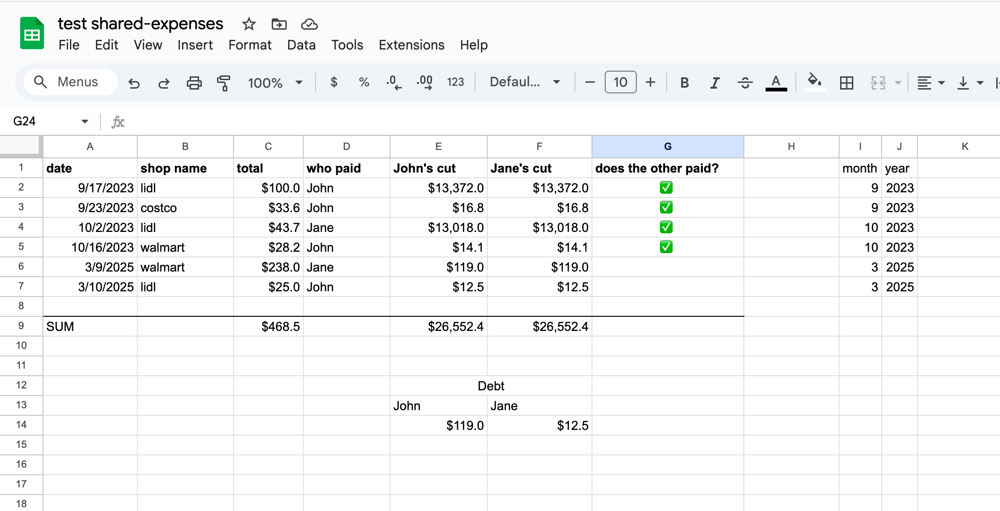

# gsheet-shared-expenses-inserter

A simple web app for managing shared expenses using a Google Sheet as the backend.

### Technologies

- React, Vite, TypeScript, shadcn, Tailwind CSS

### Screenshots





### Demo video

https://www.youtube.com/watch?v=tRBeoTJkmt4

### Start

- Create a OAuth 2.0 Client ID in Google Cloud
- Create a .env file based on .env.example

```
npm i
npm run dev
```

### Deploy

```
npm ci

cd terraform
terraform init
terraform plan -out tfplan
terraform apply tfplan
cd ..

export BUCKET_NAME=
./deploy.sh
```

### License

The MIT License (MIT)
